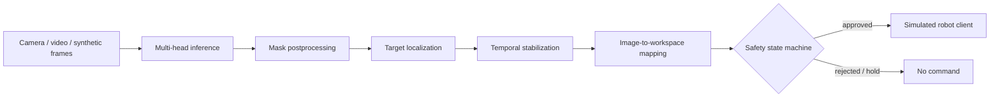

# AI Perception-to-Action Pipeline

[](https://github.com/klaudia-senator/perception-to-action/actions/workflows/tests.yml)
[](https://www.python.org/)
[](LICENSE)

A compact research demo of a real-time computer-vision system that turns scene perception into a safe, simulated action. It combines multi-head segmentation, temporal reasoning, target localization, coordinate transformation and an explicit control state machine.

The architecture is inspired by work on AI-assisted robotic systems. All hardware integration and project-specific details have been intentionally replaced with synthetic inputs, normalized coordinates and a simulation-only client.

> **Scope:** research and portfolio demonstration only. This software is not a medical device, safety controller or interface to physical hardware.

## What this project demonstrates

- A PyTorch multi-head U-Net with a shared encoder-decoder and independent output heads
- Frame preprocessing and probability-mask postprocessing
- Small-component removal, morphology and deterministic overlap resolution
- Temporal event confirmation and sudden-target-jump rejection
- Confidence-weighted target localization
- Image-to-workspace mapping with a configurable example homography
- An explicit `IDLE → ARMED → TRACKING / HOLD / ESTOP` state machine
- Video-file, camera and deterministic synthetic frame sources
- A `SimulatedRobotClient` with no network or serial implementation
- Unit and end-to-end tests plus GitHub Actions CI

## System overview



The public demo uses a color-based inference backend so it runs without private data or trained weights. `MultiHeadUNet` and `TorchInferenceBackend` show how learned inference plugs into the same pipeline when a user supplies their own authorized weights.

## Quick start

```bash
git clone https://github.com/klaudia-senator/perception-to-action.git
cd perception-to-action
python -m venv .venv
# Windows: .venv\Scripts\activate
# macOS/Linux: source .venv/bin/activate
python -m pip install -r requirements.txt
python -m pip install -e .
python demo/run_demo.py
```

Expected output includes periodic simulated targets and a final summary:

```text
frame=005 state=tracking simulated_target=(-0.591, +0.001)
...
Processed 120 frames; emitted 15 simulated commands.
```

Use a local video or camera instead of generated frames:

```bash
python demo/run_demo.py --video path/to/example.mp4
python demo/run_demo.py --camera 0
```

The example backend recognizes the synthetic color encoding; connect a trained model through `TorchInferenceBackend` for real imagery.

## Optional learned inference

```bash
python -m pip install -r requirements-ml.txt
```

```python
from perception_to_action.model import MultiHeadUNet, TorchInferenceBackend

model = MultiHeadUNet(
    heads=("foreground", "target", "context", "marker")
)
backend = TorchInferenceBackend(model, device="cpu")
```

No weights are included. Randomly initialized outputs are not meaningful; this snippet demonstrates the inference boundary only.

## Design notes

### Perception

Each model head produces a logit map. The inference adapter converts logits to probabilities, while postprocessing applies thresholds, filters small connected components, performs an optional morphological opening and assigns every pixel to at most one class.

### Temporal stability

Single-frame detections are not enough to trigger an action. The stabilizer requires repeated observations in a sliding window, averages accepted target positions and rejects discontinuities beyond a normalized jump threshold.

### Coordinate mapping

Detections are localized with a confidence-weighted centroid and normalized to image coordinates. A 3×3 homography maps them into a synthetic `[-1, 1] × [-1, 1]` workspace. The shipped matrix is deliberately illustrative and unrelated to any physical system.

### Control boundary

The controller must be armed, receive a stable high-confidence target and satisfy its command cooldown before approving a simulated command. Hold, fault and emergency-stop states suppress commands. The robot client validates normalized coordinates and records them in memory; it cannot communicate with hardware.

## Repository structure

```text
├── config/demo_config.json          # synthetic/example values only
├── demo/run_demo.py                 # end-to-end demo
├── src/perception_to_action/
│   ├── model.py                     # multi-head U-Net + inference adapter
│   ├── vision.py                    # preprocessing and postprocessing
│   ├── localization.py              # confidence-weighted centroid
│   ├── stabilization.py             # temporal filtering and jump rejection
│   ├── mapping.py                   # normalized coordinate transform
│   ├── controller.py                # explicit state machine
│   ├── robot.py                     # simulation-only client
│   ├── sources.py                   # synthetic/video/camera inputs
│   └── pipeline.py                  # orchestration
└── tests/                            # unit and integration tests
```

## Tests

```bash
python -m pip install -r requirements-dev.txt
python -m pytest -q
```

Tests cover coordinate mapping, state-machine gates, event stabilization, preprocessing/postprocessing and the full simulated pipeline.

## Privacy and responsible disclosure

This repository contains no model weights, private datasets, real calibration measurements, network addresses, ports, serial settings, physical workspace limits, proprietary command frames or project-specific safety parameters. Names and configuration values are generic examples. Do not connect this demo to physical equipment.

## Author

**Klaudia Senator** — AI/ML researcher working at the intersection of deep learning, computer vision and robotics.

